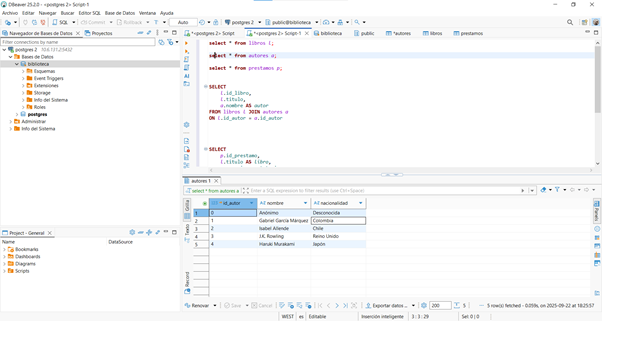
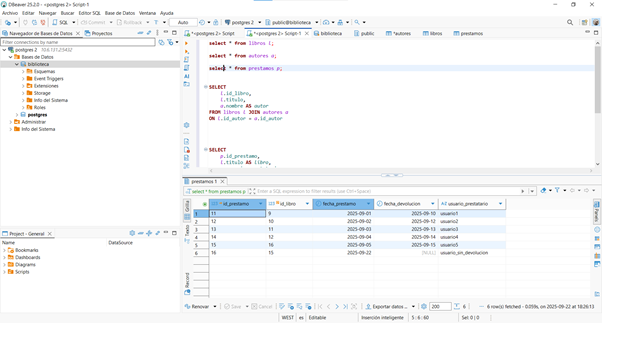
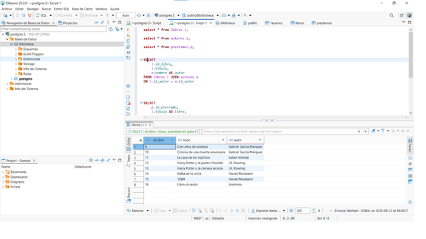
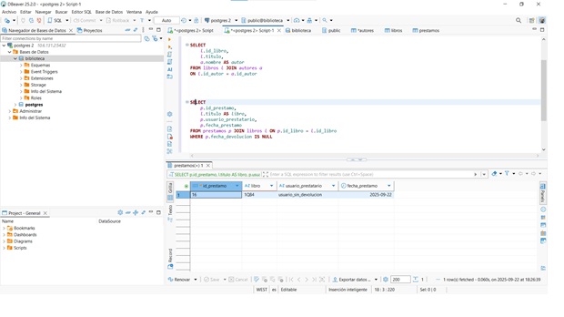
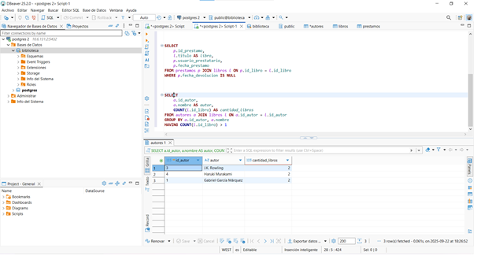
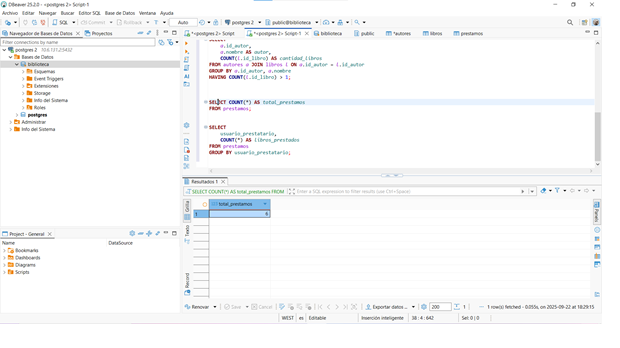
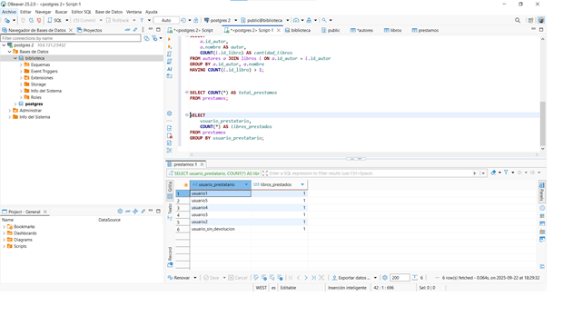
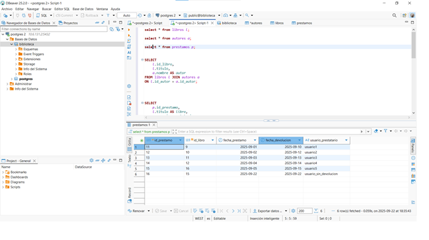
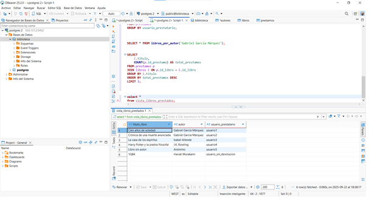

# 📚 Práctica de Base de Datos – Biblioteca (PostgreSQL)

[Las capturas de pantalla con la salida estan a partir del punto 4]

---

## 1 Creación de la Base de Datos
sql:

CREATE DATABASE biblioteca;

## 2 Creación de usuarios
Crear dos usuarios:

-- Usuario administrador

CREATE USER admin_biblio WITH PASSWORD 'admin123';

-- Usuario solo lectura

CREATE USER usuario_biblio WITH PASSWORD 'usuario123';

Crear un rol llamado lectores con permisos únicamente de consulta sobre todas las tablas de la base de datos.

CREATE ROLE lectores;

GRANT CONNECT ON DATABASE biblioteca TO lectores;

GRANT USAGE ON SCHEMA public TO lectores;

GRANT SELECT ON ALL TABLES IN SCHEMA public TO lectores;

-- Nuevas tablas tendrán automáticamente permisos de lectura

ALTER DEFAULT PRIVILEGES IN SCHEMA public

GRANT SELECT ON TABLES TO lectores;

Asignar el usuario usuario_biblio a este rol.

GRANT lectores TO usuario_biblio;

Consultar las tablas del sistema para listar todos los usuarios creados 

SELECT rolname, rolsuper, rolcreaterole, rolcreatedb, rolcanlogin

FROM pg_roles;

Cambiar la contraseña del usuario usuario_biblio.

ALTER USER usuario_biblio WITH PASSWORD 'nueva_clave';

Configurar permisos de tal forma que el usuario usuario_biblio no pueda eliminar registros en ninguna tabla.

REVOKE INSERT, UPDATE, DELETE ON ALL TABLES IN SCHEMA public FROM usuario_biblio;

##  3 Creación de la Base de Datos

-- Autores

CREATE TABLE autores (

    id_autor SERIAL PRIMARY KEY,
    
    nombre VARCHAR(100) NOT NULL,
    
    nacionalidad VARCHAR(50)
    
);

-- Libros

CREATE TABLE libros (

    id_libro SERIAL PRIMARY KEY,
    
    titulo VARCHAR(200) NOT NULL,
    
    año_publicacion INT,
    
    id_autor INT NOT NULL,
    
    CONSTRAINT fk_autor FOREIGN KEY(id_autor) REFERENCES autores(id_autor)
    
);

-- Préstamos

CREATE TABLE prestamos (

    id_prestamo SERIAL PRIMARY KEY,
    
    id_libro INT NOT NULL,
    
    fecha_prestamo DATE NOT NULL,
    
    fecha_devolucion DATE,
    
    usuario_prestatario VARCHAR(50) NOT NULL,
    
    CONSTRAINT fk_libro FOREIGN KEY(id_libro)
    
        REFERENCES libros(id_libro)
        
        ON DELETE CASCADE  -- opcional
        
);

## 4 Inserción de dato
-- Autores (el autor 0 es Anónimo)

INSERT INTO autores (id_autor, nombre, nacionalidad) VALUES

(0, 'Anónimo', 'Desconocida'),

(DEFAULT, 'Gabriel García Márquez', 'Colombia'),

(DEFAULT, 'Isabel Allende', 'Chile'),

(DEFAULT, 'J.K. Rowling', 'Reino Unido'),

(DEFAULT, 'Haruki Murakami', 'Japón');

-- Libros

INSERT INTO libros (titulo, año_publicacion, id_autor) VALUES

('Cien años de soledad', 1967, 2),

('Crónica de una muerte anunciada', 1981, 2),

('La casa de los espíritus', 1982, 3),

('Harry Potter y la piedra filosofal', 1997, 4),

('Harry Potter y la cámara secreta', 1998, 4),

('Kafka en la orilla', 2002, 5),

('1Q84', 2009, 5),

('Libro sin autor', 2025, 0);

-- Préstamos (usar IDs reales de libros)

INSERT INTO prestamos (id_libro, fecha_prestamo, fecha_devolucion, usuario_prestatario) VALUES

(1, '2025-09-01', '2025-09-10', 'usuario1'),

(2, '2025-09-02', '2025-09-12', 'usuario2'),

(3, '2025-09-03', '2025-09-13', 'usuario3'),

(4, '2025-09-04', '2025-09-14', 'usuario4'),

(5, '2025-09-05', NULL,      'usuario5'); -- préstamo pendiente

## 5 Consultas Básicas
Listar todos los libros con su autor correspondiente.

Mostrar los préstamos que aún no tienen fecha de devolución.

Obtener los autores que tienen más de un libro registrado.

## 6 Consultas con Agregación
Calcular el número total de préstamos realizados.

Obtener el número de libros prestados por cada usuario.

## 7 Modificación de Datos
Actualizar la fecha de devolución de un préstamo pendiente.

UPDATE prestamos

SET fecha_devolucion = CURRENT_DATE

WHERE id_prestamo = 16

  AND fecha_devolucion IS NULL;
  

Eliminar un libro y comprobar el efecto en la tabla de préstamos (usar ON DELETE CASCADE o justificar el comportamiento).

## FALTA

## 8 Creación de Vistas
Crear una vista llamada vista_libros_prestados que muestre: título del libro, autor y nombre del prestatario.

CREATE OR REPLACE VIEW vista_libros_prestados AS

SELECT 

    l.titulo AS titulo_libro,
    
    a.nombre AS autor,
    
    p.usuario_prestatario
    
FROM prestamos p

JOIN libros l   ON p.id_libro = l.id_libro

JOIN autores a  ON l.id_autor = a.id_autor;

Conceder permisos de consulta sobre esta vista únicamente a usuario_biblio.

GRANT SELECT ON vista_libros_prestados TO usuario_biblio;

## 9 Funciones y Consultas Avanzadas
Crear una función que reciba el nombre de un autor y devuelva todos los libros escritos por él.

Crear una consulta que devuelva los tres libros más prestados.

## 10 Exportación e importación de datos
Exportar el contenido de la tabla libros a un archivo CSV.
Importar datos adicionales de autores desde un archivo CSV externo.

## FALTA 
